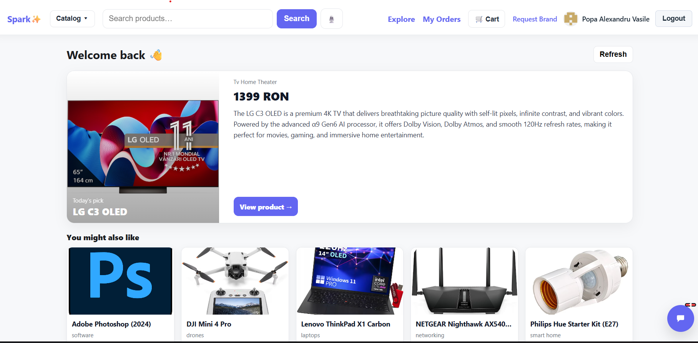
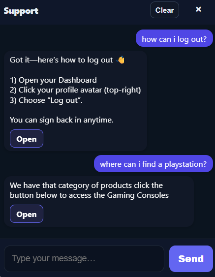

# Spark ✨ — E-Commerce Electronics with AI Chatbot & Voice Search

A full-stack demo store for electronics with:
- 🔎 **Semantic search** + **voice search**
- 🤖 **Built-in support chatbot**
- 🛒 Modern, responsive UI



---

## 🚀 Quick Start

### Option A — Docker (easiest)
```bash
docker compose up -d
Then open: http://localhost:3000

## 🧭 How to Use the App

### **1. Homepage & Catalog**
- Browse curated picks and personalized recommendations.
- Click **View product →** to open full product details.


---

### **2. Search Products (Text & Voice)**

#### **Text Search**
- Use the search bar at the top to find products like **“drone”**, **“router”**, or **“OLED TV”**.

#### **Voice Search**


Steps:
1. Click the **mic** button next to the search bar.  
2. Press **Start** and speak your query.  
3. Click **Stop & Use** to perform the search.

---

### **3. AI Support Chatbot**


- Open the **chatbot widget** at the bottom-right corner.  
- Type or ask questions like:
  - “How can I log out?”
  - “Where can I find a PlayStation?”
- The bot gives instant answers and clickable action buttons.

---
